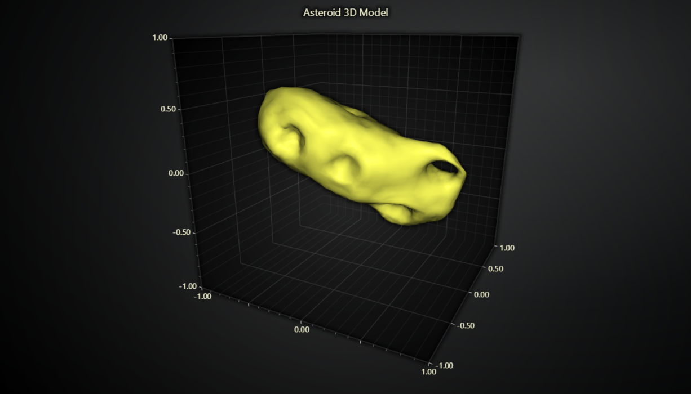

# Static 3D Mesh Model.



This demo application belongs to the set of examples for LightningChart JS, data visualization library for JavaScript.

LightningChart JS is entirely GPU accelerated and performance optimized charting library for presenting massive amounts of data. It offers an easy way of creating sophisticated and interactive charts and adding them to your website or web application.

The demo can be used as an example or a seed project. Local execution requires the following steps:

-   Make sure that relevant version of [Node.js](https://nodejs.org/en/download/) is installed
-   Open the project folder in a terminal:

          npm install              # fetches dependencies
          npm start                # builds an application and starts the development server

-   The application is available at _http://localhost:8080_ in your browser, webpack-dev-server provides hot reload functionality.


## Description

Example showcasing LightningChart 3D model visualization using Mesh Model Chart.

To create a Mesh Model chart, you can use the following line of code:

```javascript
const meshModel = chart3D.addMeshModel()
```

To render a 3D mesh model on this chart, you need to prepare the necessary data, including vertices, indices, and optionally, normals. These data can come from any 3D modeling software, such as Blender or similar tools.

In our examples, we consistently export 3D models to the .OBJ file format. To process this data into the required normals, vertices, and indices, we rely on the [webgl-obj-loader NPM library](https://www.npmjs.com/package/webgl-obj-loader) .

Once you've got your 3D model data ready in the correct format, you can easily render your model on the Mesh Model chart. This is done by using the '.setModelGeometry' function, as demonstrated in the following code:

```javascript
meshModel.setModelGeometry({
    vertices: modelParsed.vertices,
    indices: modelParsed.indices,
    normals: modelParsed.vertexNormals,
})
```


## API Links

* [Mesh Model]


## Support

If you notice an error in the example code, please open an issue on [GitHub][0] repository of the entire example.

Official [API documentation][1] can be found on [LightningChart][2] website.

If the docs and other materials do not solve your problem as well as implementation help is needed, ask on [StackOverflow][3] (tagged lightningchart).

If you think you found a bug in the LightningChart JavaScript library, please contact sales@lightningchart.com.

Direct developer email support can be purchased through a [Support Plan][4] or by contacting sales@lightningchart.com.

[0]: https://github.com/Arction/
[1]: https://lightningchart.com/lightningchart-js-api-documentation/
[2]: https://lightningchart.com
[3]: https://stackoverflow.com/questions/tagged/lightningchart
[4]: https://lightningchart.com/support-services/

© LightningChart Ltd 2009-2022. All rights reserved.


[Mesh Model]: https://lightningchart.com/js-charts/api-documentation/v5.1.0/classes/MeshModel3D.html

